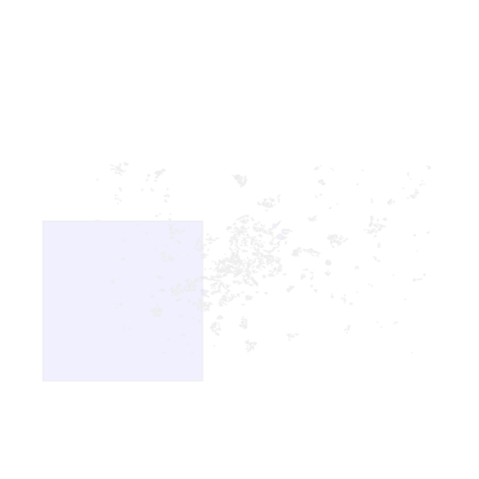
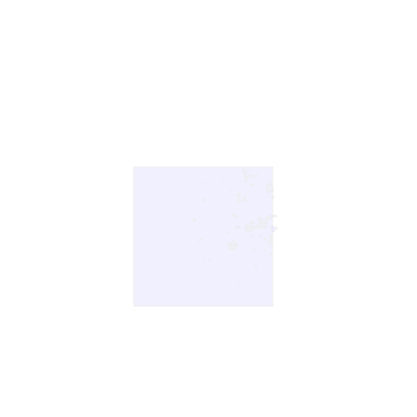

# Geospatial SVG

## Description

Strategies for generating SVG graphics from geospatial data. The technologies used are primarily: GDAL, Shapely, Python and Linux. 

A project by Goatstone, Jose Collas
[goatstone.com](https://goatstone.com)

The SVGs are generated with the use of a run script, a funtion for generating the SVG and the custom class, SVGTag.

## Examples

### Parks with labels

A script that generates an SVG of parks and bodies of water in a part of Madrid produces the following SVG graphic.

### Zoom in on area

An overview of Madrid parks with a box showing the spatial filter.

        use_spat=False
        view_spat_area=True

The spatial filter being used

        use_spat=True
        view_spat_area=True

### The Function:

Currently the following arguments are used for the function madrid/natural.py

        item_scale,
        group_scale,
        data_path,
        styles,
        cx=None,
        cy=None,
        buffer=0.2,
        use_spat=True,
        view_spat_area=True,

### SVGTag

This class renders a final SVG document that is written to disk.

### The run script

The run script can be thought of as a controller.
It runs a function with a name that reflects the kind of graphic it will produce.
The function madrid/natural.py contains most of the script that will generate an SVG graphic of natural areas in Madrid Spain.

The Process of generating an SVG file is generally as follows:

* Get the DataSource
* Get the Layer
* Write CSS a style sheet
* Write to the SVGObject with the help of Shapely
* Call the render method on the instance of SVGObject
* Write the content of what has been returned by the render method to a file

Graphics can be generated anywhere in the system but saved graphics can be found in the svg_archive folder.

## Install

### shapely 

https://pypi.org/project/shapely/

###  GDAL

https://gdal.org/

https://mothergeo-py.readthedocs.io/en/latest/development/how-to/gdal-ubuntu-pkg.html

https://pcjericks.github.io/py-gdalogr-cookbook/

### pytest

https://docs.pytest.org/en/7.4.x/

### View the SVG graphics.

I have been using primarily Linux for this project. 
On Linux the applications InkScape and ImageViewer work well to view the SVG graphics.

### Data Source

The following are links to data sources used in this project.

#### Natural Earth

https://www.naturalearthdata.com/

https://www.naturalearthdata.com/downloads/10m-cultural-vectors/10m-admin-0-countries/

### Run tests with pytest

  pytest
