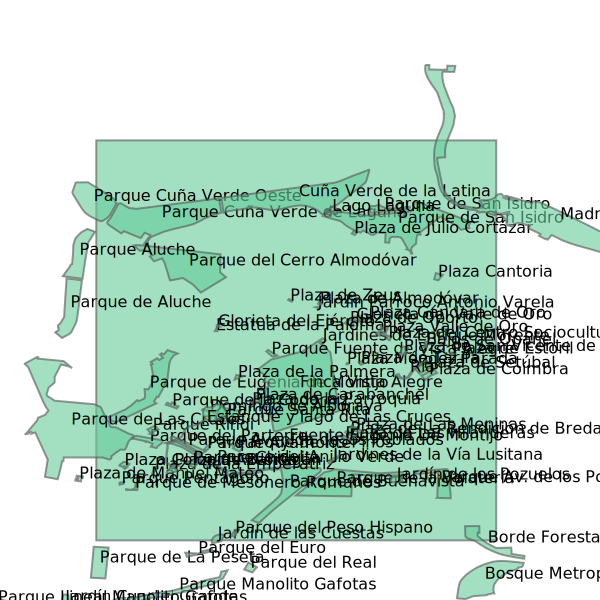

# Geospatial SVG

A project by Goatstone, Jose Collas
[goatstone.com](https://goatstone.com)

## Description

This repository attempts to establish strategies for generating SVG files representing Geospatial data.
The technologies used are primarily: GDAL, Shapely, Python and Linux. 
GDAL for accessing data from various sources. Shapely for the creation and modification of geo data.
Python is the scripting language that puts it all together and will be running the commands.

## Example

A script that generates an SVG of parks and bodies of water in a part of Madrid.

run:

  python3 generate_madrid_natural.py

The SVGs are generated with the use of a run script and two custom Python classes:

### Features
A class to store data and Shapely objects created from the data.

### SVGTag
A class that is built out from an instance of the Features class. This class renders a final SVG document that is written to disk.

### Scripts

#### The run script

Scripts that run the commands to process the data and write the file. 

The run script can be thought of as a controller. See the file

  generate_madrid_natural.py

Configuration is stored as a path to the data and a destination to write the file.
  DATA_PATH FILE_DESTINATION
  These values can be stored in a file called:

  env_vars

  export DATA_PATH='your value here'
  export FILE_DESTINATION='your value here'

  then with the command 
  
   source env_var

  these values can be read by the Python scripts.

SQL commands retrieve data and a Python function does the work.

### Use of the command line

Command line script cand be found in the file:  ogr_command.sh

run with

 ./ogr_command.sh

### Run tests with pytest

## Install

## These Python scripts use several libraries.

### shapely 

https://pypi.org/project/shapely/

###  GDAL

https://gdal.org/

https://mothergeo-py.readthedocs.io/en/latest/development/how-to/gdal-ubuntu-pkg.html

https://pcjericks.github.io/py-gdalogr-cookbook/

### pytest

https://docs.pytest.org/en/7.4.x/

### View the SVG graphics.

I have been using primarily Linux for this project. 
On Linux the applications InkScape and ImageViewer work well to view the SVG graphics.

### Data Source

The following are links to data sources used in this project.

#### Natural Earth

https://www.naturalearthdata.com/

https://www.naturalearthdata.com/downloads/10m-cultural-vectors/10m-admin-0-countries/

## Other Related Links

https://mapscaping.com/how-to-read-a-shapefile-using-python/

https://shapely.readthedocs.io

https://catalog.data.gov/dataset/?metadata_type=geospatial&vocab_category_all=Water

https://www.learndatasci.com/tutorials/geospatial-data-python-geopandas-shapely/

https://docs.github.com/en/actions/automating-builds-and-tests/building-and-testing-python

https://www.geopackage.org/

https://docs.qgis.org/

https://libgeos.org/

https://en.wikipedia.org/wiki/Geographic_coordinate_conversion#From_geodetic_to_ECEF_coordinates

https://en.wikipedia.org/wiki/Geodetic_datum#World_Geodetic_System_1984_(WGS_84)